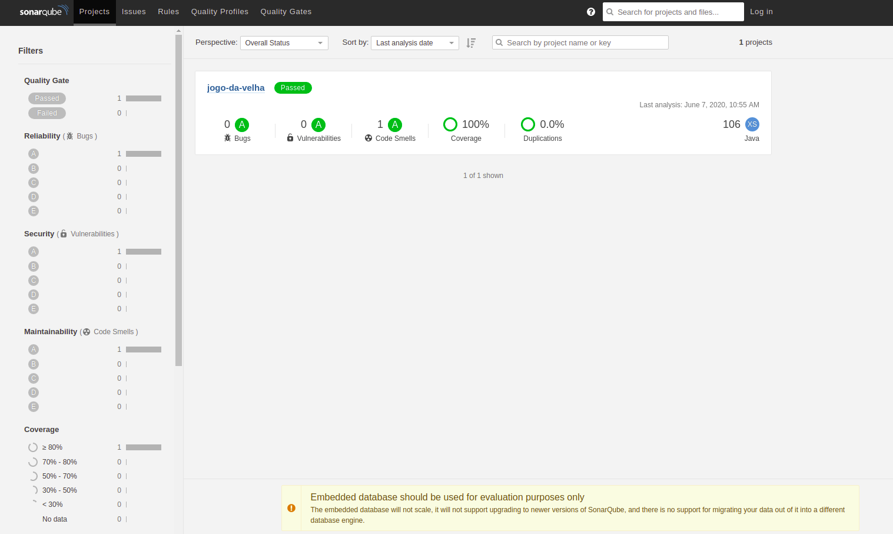
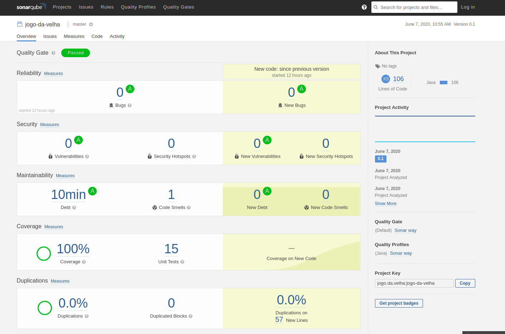
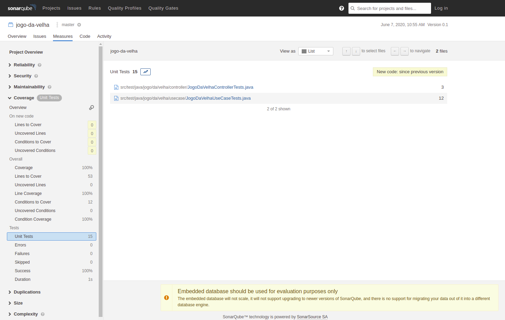

# jogo-da-velha

# Apresentação

https://docs.google.com/presentation/d/1TUHS9r-4T--vL3K3VQb0KJVRoTRGsktwn_5xRIyWIag/edit?usp=sharing

# URLs

**SWAGGER** -> http://52.149.209.133:8080/swagger-ui

**HEALTHCHECK** -> http://52.149.209.133:8080/health

# CURL

```
curl -X POST "http://52.149.209.133:8080/jogovelha" -H "accept: application/json" -H "Content-Type: application/json" -d "{\"jogo\":[\"XXX\",\"OOX\",\"XOX\"]}"
```

# Build with gradle

./gradlew clean build

# Docker

./gradlew assemble

docker build . -t jogo-da-velha:v1

docker run -d -p 8080:8080 jogo-da-velha:v1

# Sonarqube







